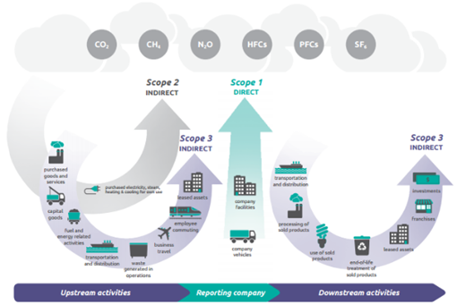

# 2. Méthodologie

La partie « Méthodologie » ci-dessous précise et justifie les choix que nous avons faits, par volonté de totale transparence de la démarche.

## 2.1 GHG Protocol

The calculator follows the Greenhouse Gas Protocol, the international standard for calculating greenhouse gas emissions.

### À propos du GHG Protocol (FR)

Le GHG Protocol (Green House Gas Protocol) est une norme internationale pour la comptabilisation et la gestion des émissions de GES. Il a été élaboré par le World Resources Institute (WRI) et le World Business Council for Sustainable Development (WBCSD) en 1998. Il est une des normes les plus utilisées au niveau international pour mesurer et rapporter les émissions de GES. La précédente version (v4) du bilan GES réglementaire français était très proche du GHG Protocol.

Le protocole définit trois catégories d'émissions, appelées « scopes » :

- **Scope 1** : les émissions directes de GES provenant des sources contrôlées par l'organisation, telles que les émissions de dioxyde de carbone (CO₂), de méthane (CH₄) et de protoxyde d'azote (N₂O) résultant des combustibles fossiles brûlés dans les installations de l'organisation, ou des émissions de CH₄ et N₂O provenant des procédés industriels.
- **Scope 2** : les émissions indirectes de GES provenant de la production d'électricité, de chaleur ou de vapeur achetées par l'organisation.
- **Scope 3** : toutes les autres émissions indirectes de GES qui résultent des activités de l'organisation (matières premières et produits achetés, transport des biens et des personnes, déchets, etc.).

Postes inclus dans l’outil (exemples) :

- 3.1 : achats de produits ou services
- 3.2 : émissions liées aux immobilisations de biens (émissions intégrées hors phase d’usage)
- 3.3 : émissions « amont » liées à la chaîne de production d’énergie finale (extraction, transport, raffinage/traitement, distribution)
- 3.4 : transport de marchandise amont
- 3.5 : déchets (transport et traitement)
- 3.6 : déplacements professionnels (déplacements, nuitées, défraiements)
- 3.7 : déplacements domicile–travail
- 3.8 : actifs en leasing amont (fabrication des biens loués)
- 3.15 : investissements

Pour les postes 1.1, 1.2, 2.1 et 2.2 (scopes 1 et 2), les émissions liées aux consommations d'énergie ont été calculées en utilisant les facteurs d'émission « hors amont ». Les émissions liées à « l'amont » des combustibles ont été comptabilisées dans le poste 3.3.

Voir aussi : **[GHG Protocol scope definition](https://ghgprotocol.org/blog/you-too-can-master-value-chain-emissions)**

### About the GHG Protocol (EN)

The Greenhouse Gas Protocol is the world’s most widely known and adopted GHG emissions accounting standard and reporting guideline. It provides organizations with a clear framework for calculating emissions from their operations and value chains in order to identify opportunities for reduction. Our labs footprint calculation tool strives to follow the GHG Protocol as accurately as possible.

## 2.2 System boundaries

Contenu à venir.